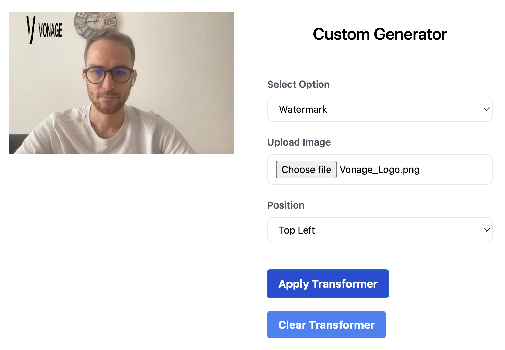

# Video Stream Transformer

This repository contains code to modify a video stream using [@vonage/media-processor](https://www.npmjs.com/package/@vonage/media-processor) package. It allows users to overlay a QR Code or a watermark image onto a video stream.

## Features

- Upload and display an image as a watermark on the video stream.
- Generate a QR Code from a given link and display it on the video stream.

## Screenshots

## Prerequisites

Before you begin, ensure you have met the following requirements:

- You have installed the latest version of [Node.js](https://nodejs.org/en/).
- You have a basic understanding of JavaScript.

## Usage

The video stream transformer is an interface with two main functionalities:

1. **QR Code**: Input a URL into the text box to generate a QR Code. This QR Code will then be displayed on the video stream.
2. **Watermark**: Upload an image to be used as a watermark on the video stream.

To apply the selected transformer, click on the "Apply" button.

In case you want to clear the transformations applied to the video stream, click on the "Clear" button.

## Code Overview

The code imports the necessary packages and initializes a publisher using the OpenTok client library.

There are two main functionalities:

1. **QR Code**: The `applyQrCode` function generates a QR Code from the provided text input and applies it to the video stream.

2. **Watermark**: The `applyWatermark` function overlays an uploaded image onto the video stream.

The `flipImage` function is used to flip the image horizontally. This is necessary because the publisher's video stream is mirrored by default.
